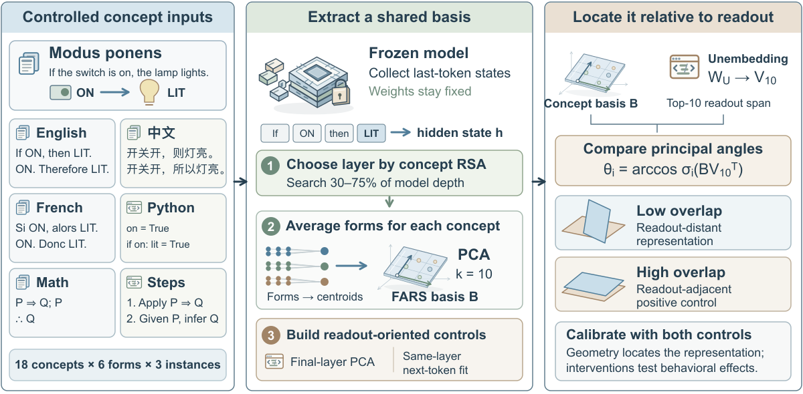

<div align="center">

# FARS
### Concept Subspaces Beyond the Logit Lens

**Concept Subspaces Compute Beyond the Logit Lens:**<br>
**A Weights-Only Test for Locating Representations Upstream of Readout**

[Paper record](https://arxiv.org/abs/2605.09496) · [Getting started](#quick-start-no-gpu-required) · [Research code](fars/README.md) · [Limitations](fars/KNOWN_LIMITATIONS.md)

Aojie Yuan · Zhiyuan Julian Su · Haiyue Zhang · Zijian Su<br>
University of Southern California · Duke University · University of Michigan

</div>

**Can a concept representation influence behavior while remaining far from the model's dominant output directions?** FARS studies this question by extracting a shared subspace from different expressions of the same reasoning concepts, then comparing its geometry with the unembedding readout.



*Method overview. Examples, icons and point arrangements are schematic. Geometric overlap and behavioral intervention are separate measurements; the figure does not report performance gains.*

## What this project measures

- **Shared concept structure.** TriForm expresses 18 reasoning concepts in six forms—English, Chinese, French, Python, mathematical notation and structured steps—with three instances each (324 stimuli). Concept-centroid PCA extracts a rank-10 basis.
- **Position relative to readout.** Principal angles and projection energy compare a concept basis with the dominant right-singular directions of the unembedding matrix. Output-oriented controls help interpret the comparison.
- **Transfer and behavioral effects.** A disjoint Novelty inventory contains 10 concepts and 180 stimuli. Separate intervention experiments examine what changes when representations are perturbed.

**“Weights-only” applies to the raw readout comparison once a concept basis is supplied.** Extracting that basis uses activations and concept labels; depth matching requires an additional fitted translator. Low overlap with a top-rank readout span does not imply that a representation contains no output information or is sufficient for reasoning.

## Release status

This repository is **public**. The code and recorded results under [`fars/`](fars/) are a **September 26, 2026 research snapshot**, not a fully packaged reproduction of the evolving manuscript. Documentation and the overview figure were refreshed on September 29.

| Material | Availability |
| --- | --- |
| Raw readout diagnostic and analytic tests | Included; runs with NumPy on CPU |
| TriForm and Novelty stimulus generators | Included |
| Activation extraction and research analysis scripts | Included; models, caches and some external inputs must be supplied |
| Selected historical result JSONs | Included; recorded outputs, not newly reproduced by installing this repository |
| September 28–29 norm-matched task and frozen-basis audits | Not included in this published snapshot yet |
| Model weights and large activation caches | Not distributed |
| Current revised manuscript | Not bundled; the arXiv link may show an earlier title and author list |

The [arXiv record](https://arxiv.org/abs/2605.09496) originated as *Beyond Language: Format-Agnostic Reasoning Subspaces in Large Language Models*. The heading and author list above describe the revised manuscript in preparation. Use the metadata of the public version you actually cite.

## Quick start: no GPU required

```bash
git clone https://github.com/Justin0504/LLM-representation-agnostic.git
cd LLM-representation-agnostic
python3 -m venv .venv
source .venv/bin/activate
python -m pip install numpy
cd fars
python -m unittest test_readout_geometry -v
```

The tests check analytic matrix cases and input validation. They do not download a model or reproduce the empirical study.

For a minimal executable example, stay in `fars/`:

```python
import numpy as np
from readout_geometry import compare

B = np.eye(4)[:2]                 # two orthonormal concept-basis rows
V = np.eye(4)[2:]                 # an orthogonal rank-2 readout span
result = compare(B, V)
print(result["energy_percent"])   # 0.0
print(result["principal_angles_radians"])  # [pi/2, pi/2]
```

For your own arrays:

```bash
python readout_geometry.py --basis B.npy --readout-basis V10.npy
# Or derive the readout basis from a vocabulary-by-hidden unembedding:
python readout_geometry.py --basis B.npy --unembedding W_U.npy
```

Both bases must have orthonormal rows and the same shape `(rank, hidden_dimension)`. Inputs are NumPy `.npy` files. Output includes principal angles in radians, Grassmann distance, readout-energy fraction/percent and the Haar expectation. Computing a full unembedding SVD can be expensive.

## Run the research pipeline

See the [research README](fars/README.md#research-pipeline) for installation and an extraction → basis → readout example. It identifies the expected files, layer-selection differences and reproduction boundaries. Run those commands from `fars/`; the root-level scripts belong to the earlier pilot.

## Repository map

```text
fars/
├── readout_geometry.py       # Standalone raw-readout reference
├── test_readout_geometry.py  # Analytic tests
├── benchmark/               # TriForm and Novelty stimuli
├── src/                     # Extraction, metrics and subspace utilities
├── analysis/                # Research scripts and recorded JSON outputs
├── results/                 # Selected historical results
├── run_xfars.py              # Historical alignment implementation
├── KNOWN_LIMITATIONS.md     # Method and reproduction boundaries
└── MANIFEST.json            # Snapshot file hashes

docs/assets/                 # Project overview illustration
PILOT_README.md               # Original pilot, context and attribution
```

## Interpretation and reproducibility

The geometric diagnostic and the behavioral experiments answer different questions. Intervention effects do not establish causal sufficiency. Re-extracting a basis on unseen concepts is also different from transferring one fixed basis.

Historical scripts use different layer selectors and experimental protocols; their results should not be pooled without checking those settings. In particular, the historical X-FARS polar update is **not generally an exact least-squares minimizer** for rectangular projections. Alignment scores are empirical summaries, not optimizer guarantees. Read the [known limitations](fars/KNOWN_LIMITATIONS.md) before extending the experiments.

For an issue or reproduction report, include the commit, script, model checkpoint, layer selector, seed, dependency versions and a minimal command. Please do not post credentials or private server configuration.

## Attribution and licensing

The original pilot documentation and upstream attribution are retained in [PILOT_README.md](PILOT_README.md). No repository-wide license has been added; public visibility should not be interpreted as an open-source license grant. Model checkpoints and third-party datasets remain subject to their own terms.
